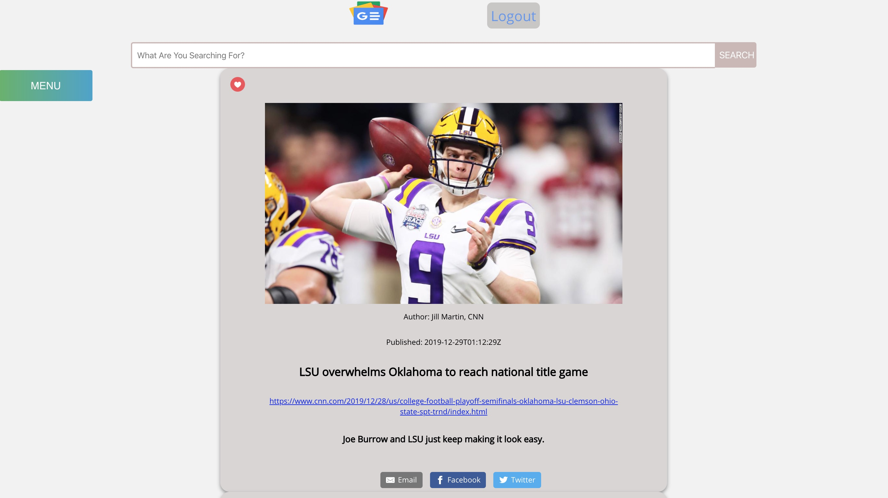

This is an app based on Google news

As user, one is able to create a profile, change their photo and sign in and sign out using JWT Auth going to a rails backend API

A user can save their favorite articles, see all of their saved searches as well as rerender them by clicking on the search.

The articles come from the newsapi.org API
This app uses the following node packages:
1. react-live-clock
2. react-offcanvas
3. react-linkify
4. firebase
5. sweetalert
6. react-sharingbuttons
7. axios

The app was built using a combination of React, Redux, and Hooks
